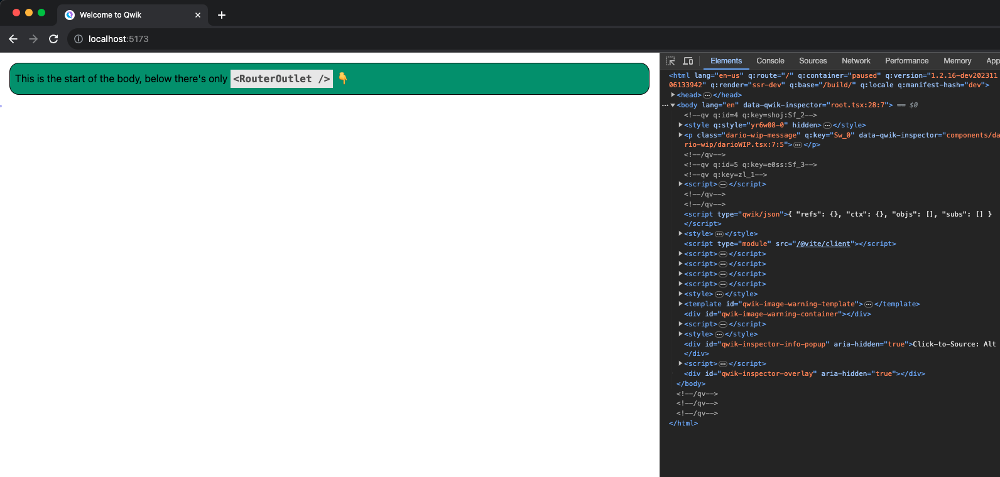

# To run the app

Fork the following github repo branch: https://github.com/dario-piotrowicz/qwik/tree/workerd-ssr

Build the vite qwik code with `pnpm build.vite`

Here the package.json in the following way:
```diff
-    "@builder.io/qwik": "/Users/dario/Repos/qwik/packages/qwik",
-    "@builder.io/qwik-city": "/Users/dario/Repos/qwik/packages/qwik-city",
+    "@builder.io/qwik": "<YOUR_QWIK_FORK_LOCATION>/packages/qwik",
+    "@builder.io/qwik-city": "<YOUR_QWIK_FORK_LOCATION>/packages/qwik-city",
```

Run the application with `pnpm dev --host`

> **Note**
> Not sure why it only works with `--host` that's something to be investigated

You should see something like this:


Where the button with the green background is a qwik component with it's own on click handler (showing that qwik works to some extent).

But the qwik-city context is lost, resulting in an empty page below the above mentioned component.