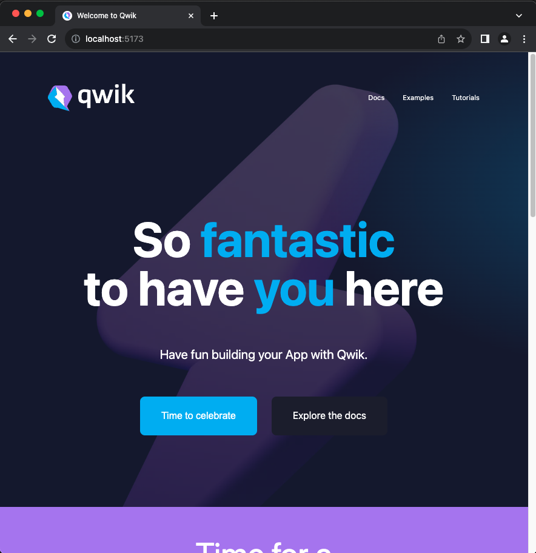

# To run the app

Fork the following github repo branch: https://github.com/dario-piotrowicz/qwik/tree/workerd-ssr

Update qwik package.json in the following way:

```diff
-    "workerd-vite-utils": "/Users/dario/Repos/my-repos/preact-vite-workerd-ssr/workerd-vite-utils"
+    "workerd-vite-utils": "<THE_ROOT_OF_THIS_MONOREPO>/workerd-vite-utils"
```

Build the vite qwik code with `pnpm build.vite` (or `pnpm build.full` to build everything)

Here update the package.json in the following way:

```diff
-    "@builder.io/qwik": "/Users/dario/Repos/qwik/packages/qwik",
-    "@builder.io/qwik-city": "/Users/dario/Repos/qwik/packages/qwik-city",
+    "@builder.io/qwik": "<YOUR_QWIK_FORK_LOCATION>/packages/qwik",
+    "@builder.io/qwik-city": "<YOUR_QWIK_FORK_LOCATION>/packages/qwik-city",
```

Run the application with `pnpm dev`

You should see the standard (fully working qwik-city starting app):
