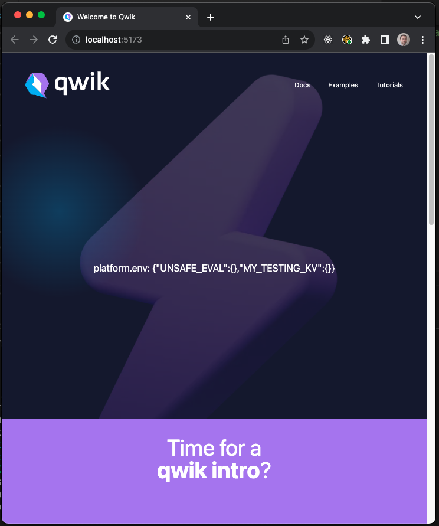

# To run the app

In `workerd-vite-utils/src/index.ts` replace the following line pointing to
there you plan to for the qwik repo:

```diff
// temporary hack, we need to figure out node_modules resolution!
-moduleId = '/Users/dario/Repos/my-repos/qwik/node_modules/.pnpm/zod@3.22.4/node_modules/zod/lib/index.mjs';qwik-city",
+moduleId = '<YOUR_QWIK_FORK_LOCATION>/node_modules/.pnpm/zod@3.22.4/node_modules/zod/lib/index.mjs';qwik-city",
```

Then build the `workerd-vite-utils` package with `pnpm build` and `pnpm build:types`

Fork the following github repo branch: https://github.com/dario-piotrowicz/qwik/tree/workerd-ssr-with-bindings

Update qwik package.json in the following way:

```diff
-    "workerd-vite-utils": "/Users/dario/Repos/my-repos/preact-vite-workerd-ssr/workerd-vite-utils"
+    "workerd-vite-utils": "<THE_ROOT_OF_THIS_MONOREPO>/workerd-vite-utils"
```

Build the vite qwik code with `pnpm build.vite` (or `pnpm build.full` to build everything)

Here update the package.json in the following way:

```diff
-    "@builder.io/qwik": "/Users/dario/Repos/qwik/packages/qwik",
-    "@builder.io/qwik-city": "/Users/dario/Repos/qwik/packages/qwik-city",
+    "@builder.io/qwik": "<YOUR_QWIK_FORK_LOCATION>/packages/qwik",
+    "@builder.io/qwik-city": "<YOUR_QWIK_FORK_LOCATION>/packages/qwik-city",
```

Run the application with `pnpm dev`

You should see the following fully working qwik-city starting app:


> ** Note **
> Notice the `MY_TESTING_KV` present there, it is a Cloudflare binding obtained by Miniflare